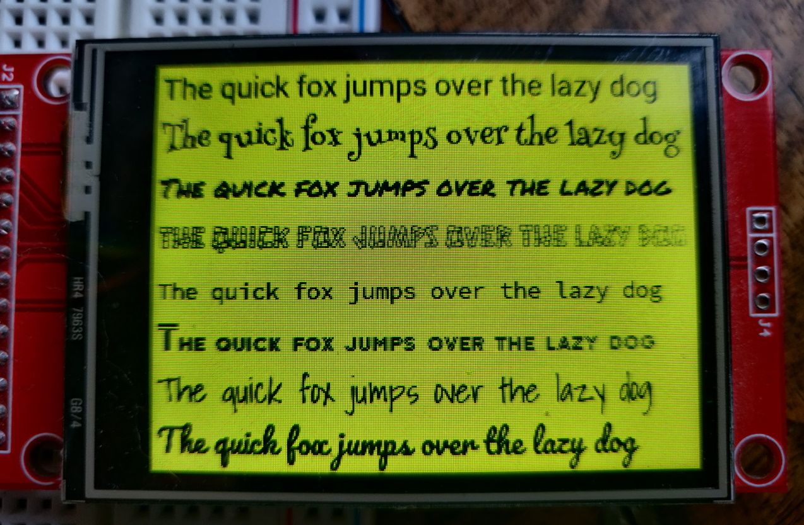

# tgx-font
A collection of plain and anti-aliased fonts to use with the [tgx 2D/3D graphic library](https://github.com/vindar/tgx)

The plain fonts are encoded in `ILI9341_t3_font_t` v1 format compatible with the [ILI9341_t3](https://github.com/PaulStoffregen/ILI9341_t3) library.

The antialiased fonts are in `ILI9341_t3_font_t` v2.3 format whose description can be found [here](https://github.com/projectitis/packedbdf) and supported also by the Teensy specific [ILI9341_t3n](https://github.com/KurtE/ILI9341_t3n) library. 

**A preview of all the fonts is available [here](https://vindar.github.io/tgx-font/font-list.html).**

## Notes

1. All fonts were downloaded from [Google Font](https://fonts.google.com/)

2. The repo is organized as follow
    - `/ttf` contains the original font in ttf format.
    - `/bdf` contains the font converted to BDF (version 2.3 with AA). 
    - `/src` contains the .cpp/.h files with the font in the final `ILI9341_t3_font_t` format. 
    - `/tools` contains a Python3 script to convert from bdf fonts to source .cpp/.h files.
    - `/examples` contains examples on how to use the fonts (for Teensy, with [tgx](https://github.com/vindar/tgx) and my [ILI9341_T4 driver](https://github.com/vindar/ILI9341_T4)).
 
3. The naming of the fonts follows the convention: `font_[FONTNAME]_[AAx]_[lite]_[SIZE]` where
  - `FONTNAME` is the name of the font (possible including the 'italic' or 'bold' qualiier)
  - `AAx` is the antialiasing strategy:
    - `AA2` for 2 bit (4 levels of gray).
    - `AA4` for 4 bit (16 levels of gray).
    - Nothing for plain font (no anti-aliasing).
  - `lite` means that only the characters 32-126 are available in the font (in order to make the font smaller). If this qualifier is omitted, all available characters in the range 32-255 are included in the font.
  - `SIZE` if the ref. height of the font in pixels. 
  
 4. Each font is available in size `8,9,10,14,16,18,20,24,28,3,36` and in plain/AA2/AA4 format. Each font is also generated in normal and lite version.  
